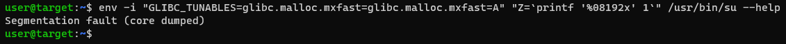
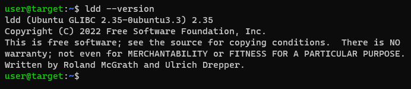
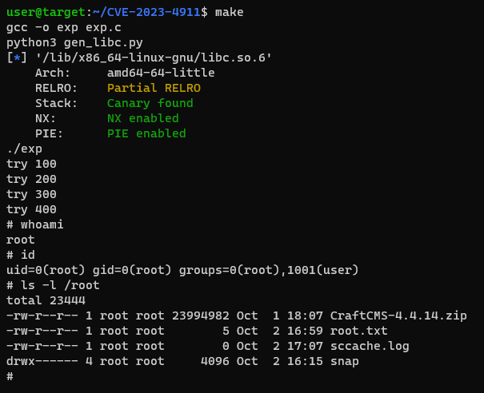

# CVE-2023-4911
This is a PoC (Proof Of Concept) for the Looney Tunables Linux Privilege Escalation vulnerability. This is based on [this PoC](https://github.com/leesh3288/CVE-2023-4911). Great thanks to `leesh3288`. [Here](https://seclists.org/oss-sec/2023/q4/18) you can find a very detailed writeup, and [here](https://youtu.be/1iV-CD9Apn8) you can see a very cool video by IppSec.

## Usage
Check if it's vulnerable
```bash
env -i "GLIBC_TUNABLES=glibc.malloc.mxfast=glibc.malloc.mxfast=A" "Z=`printf '%08192x' 1`" /usr/bin/su --help
```


It is worth saying that vulnerable `glibc` versions are, including this one, from `2.35-0ubuntu3.3` and below.



Run the exploit
```bash
$ make
```

